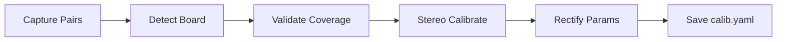
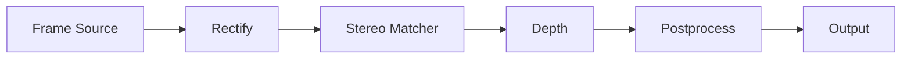

# Stereo Depth Toolkit

Toolkit for capturing and preparing stereo camera data for depth estimation.

## Current Features

✔ SBS stereo preview  
✔ calibration image collection  

---

## Hardware

This project uses a USB stereo camera exposing:

| Device | Purpose |
|--------|--------|
| /dev/video0 | SBS stitched stream |
| /dev/video2 | left camera |
| /dev/video3 | right camera |

---

## Environment Setup

```bash
conda env create -f environment.yml
conda activate CV   # 或你的新 env 名稱
```

---

## Data Flow
Calibration:


Runtime:

---
## Preview Stereo Stream

```bash
stereo-depth preview --path /dev/video0 --width 2560 --height 720 --fps 30
```

If left/right appear swapped:

```bash
stereo-depth preview --path /dev/video0 --swap-lr
```

---
## Record & Replay Video
Record:
```bash
ffmpeg -f v4l2 -input_format mjpeg -video_size 2560x720 -framerate 30 \
  -i /dev/video0 -t 10 -c:v libx264 -pix_fmt yuv420p sbs_scene_10s.mp4
```
Replay:
```bash
ffplay sbs_scene_10s.mp4
```
mp4 to avi:
```bash
ffmpeg -y -i sbs_calib_20s.mp4 -c:v mjpeg -q:v 3 -an sbs_calib_20s_mjpg.avi
```

Or:
```bash
stereo-depth preview --video "sbs_scene_10s_mjpg.avi"
```
---
## Collect Calibration Images

Use a Charuco or checkerboard board.

```bash
stereo-depth collect --path /dev/video0
```

Controls:

* SPACE → save stereo pair
* q → quit

Output:

```
calib_data/
  left/
  right/
```

Capture 30–60 image pairs from different angles.

---

## Calibration
```bash
stereo-depth calibrate \
  --data data/calib/charuco_2026-02-14_run1 \
  --out outputs/calib/calib.yaml \
  --square-length 0.03 \
  --marker-length 0.022 \
  --dict-name DICT_5X5_100 \
  --min-views 10
```

## Requirements

* Python 3.10
* OpenCV
* NumPy